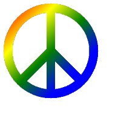

# CanvasLite

An html canvas implementation in pure JavaScript

**version: 0.9.92** (71 kB minified)

**Uses:**

1. [Gradient](https://github.com/foo123/Gradient)
2. [Rasterizer](https://github.com/foo123/Rasterizer)

**What is not supported:**

1. `lineDash`/`lineDashOffset` (**will be** implemented)
2. `strokeText`/`fillText`/`measureText` ..  (will **not** be implemented but can be done by drawing the actual curves in the font)
3. `shadow`/`shadowBlur`/`shadowColor` .. (will **not** be implemented but is easy to do)

**test/demo:**

```js
const CanvasLite = require(__dirname + '/../build/CanvasLite.js');
// colorful peace sign
const canvas = new CanvasLite(300, 300);
const ctx = canvas.getContext('2d');
const gradient = ctx.createLinearGradient(20, 20, 180, 180);
gradient.addColorStop(0.0, 'red');
gradient.addColorStop(0.33, 'yellow');
gradient.addColorStop(0.66, 'green');
gradient.addColorStop(1.0, 'blue');
ctx.strokeStyle = gradient;
ctx.lineWidth = 21;
ctx.beginPath();
ctx.arc(125, 125, 106, 0, 2*Math.PI);
ctx.closePath();
ctx.moveTo(125, 19);
ctx.lineTo(125, 19+212);
ctx.moveTo(125, 125);
ctx.lineTo(125-75, 125+75);
ctx.moveTo(125, 125);
ctx.lineTo(125+75, 125+75);
ctx.stroke();
// save drawing to disk
canvas.toPNG().then((png) => require('fs').writeFile(__dirname + '/peacecolor.png', png, (err) => {
    if (err)
    {
        console.log(err);
    }
    else
    {
        // read the image back to canvas and resize it
        const img = new CanvasLite.Image();
        img.onload = () => {
            const canvas2 = new CanvasLite(200, 200);
            canvas2.getContext('2d').drawImage(img, 0, 0, 300, 300, 0, 0, 200, 200);
            canvas2.toPNG().then((png) => require('fs').writeFile(__dirname + '/peacecolor2.png', png, (err) => {
                if (err) console.log(err);
            }));
        };
        img.src = __dirname + '/peacecolor.png';
    }
}));
```

**result:**



